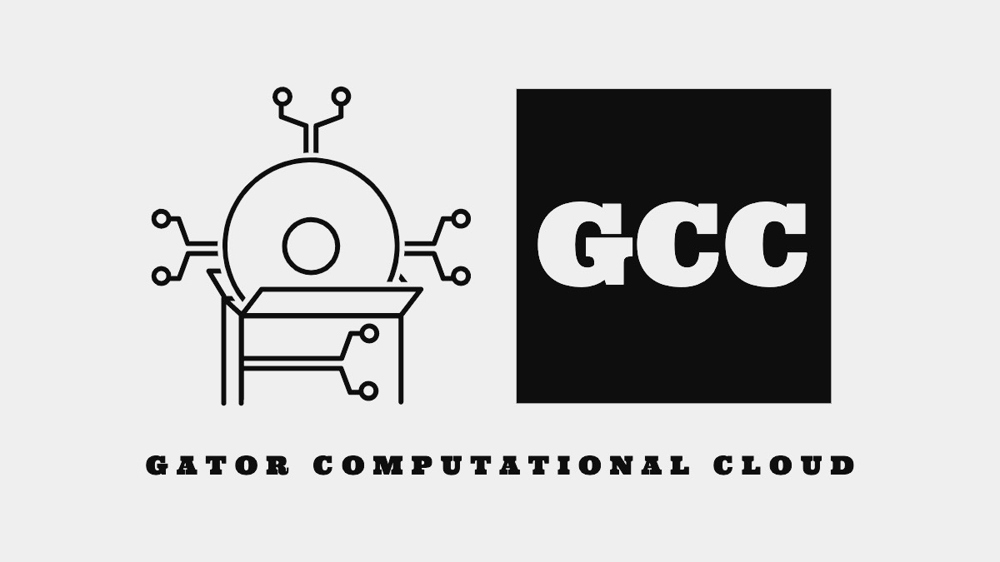

# Gator Computational Cloud

A lightweight framework for the execution of scientific workflows.

## Overview

A scientific workflow is a cluster of nodes that work together to accomplish an end goal. When executing a workflow, especially one associated with big data, there is often a massive amount of data and time overhead to work around. Because of this, there is a need for efficient and easy-to-use software that allows for the execution of workflows on obscure computing resources. This new model mitigates the need for massive infrastructure investments by the party that is executing a workflow. Additionally, the demand for efficient task scheduling solutions is ever-increasing. All of these are issues that can be tackled with the proper implementation of a grid computing system. This grid computing approach combined with efficient task scheduling is the focus of my project: Gator Computational Cloud (GCC). GCC is a lightweight web framework that utilizes a generic task scheduling algorithm to schedule jobs in a cloud environment. This framework intelligently manages dependencies and takes a multi-threaded execution approach to increase efficiency. To execute nodes, GCC takes advantage of the Amazon AWS API to provision virtual machines. Once provisioned, the tool completes the execution and transfers any dependencies to their corresponding VM in real-time utilizing an intelligent socket infrastructure. The goal of the project is to provide a lightweight and user-friendly environment for workflow execution, while also ensuring a powerful and efficient backend that completes a user’s workflow with ease. To achieve this, some preliminary experimentation has taken place to ensure the effectiveness of the tool.

## Initial Steps

Gator Computational Cloud does not currently have a package that is installable through the pip or pipx repositories. This is to ensure that a true XaaS approach is adopted for the software. Instead, the functionalities of the tool can be accessed by navigating to <https://gatorcompcloud.com/>.

### Logging In

If you already have an account with gator computational cloud, the landing page will accept your username and password and redirect you to your account dashboard.

### Signing Up

Once on the landing page, you will need to create an account if you do not already have one. Navigate to the button that says `Sign up`. When this button is clicked it will redirect you to a signup page where you can create an account with your own credentials. Upon completion of this form, you will be logged in and redirected to your account dashboard.

### Account Dashboard

Upon successful authentication, you will be redirected to your account dashboard. This screen displays a welcome message and contains the links to three separate pages: the external account credential page, the workflow page, and the machine pool page. If your external account credentials are not yet set up, any attempt to reach a different page will redirect you to the external account credential page.

### External Account Credentials

On this page, you will be presented with two sections: one section for configuring Dropbox credentials, and another for configuring AWS credentials. If both of these items are complete, a thumbs up will be displayed along with a short success message to let you know. If they are not set up, you will be presented with options to configure both.

For Dropbox credentials, clicking on the configure button will take you to Dropbox’s login page where you will be asked to log in and give `GatorCompCloud` authorization to your account. The application cannot see files outside of its application folder. Once this is complete, a valid refresh token will be generated for your account and can be viewed from the web interface.

For AWS credentials, a simple form will be presented to you. Once you get your credentials from the AWS IAM console associated with your account, you can paste them into the form and submit it. The required credentials are a valid access and secret key.

## Managing Workflows

Workflows are an integral part of Gator Computational Cloud. This is where you can define the computational payloads to be executed in the cloud. The steps for developing a successful workflow will be discussed in a later section.

### Submitting Workflows

To submit a workflow, you must add the “GatorCompCloud” application to your Dropbox account. You can do this through the web interface using the steps outlined above. Once the `Apps` folder exists in your Dropbox console, navigate to `Apps/GatorCompCloud` and place your valid workflow folder into this directory. Once the workflow is placed here, it will be displayed in the web console on the workflow page. 

### Validating Workflows

To validate your workflows, navigate to the bottom of the workflow page and click `Validate Workflows`. After a brief time you will be redirected to a page very similar to the first, but containing only valid workflows that Gator Computational Cloud has identified will execute as expected.

### Executing Workflows

On the workflow page, any workflow that is displayed will contain an `Execute` button. To execute this workflow and produce the expected output result in your Dropbox account, click this button. This process is non-blocking so you will be redirected to the same page once the execution task is spawned. Initially, a folder called `exec` will be created in the workflow base folder in your Dropbox account. Once the execution is complete, this folder will be filled with logs and output data (if applicable). 
